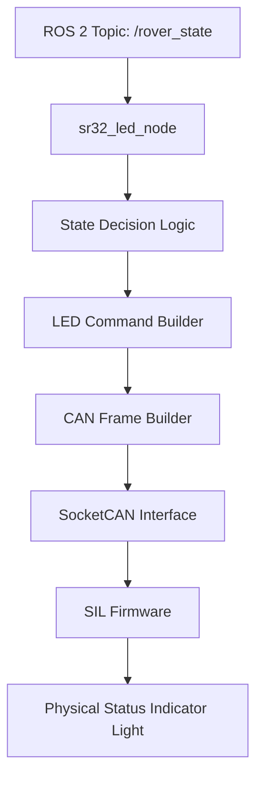
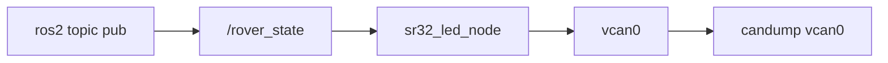
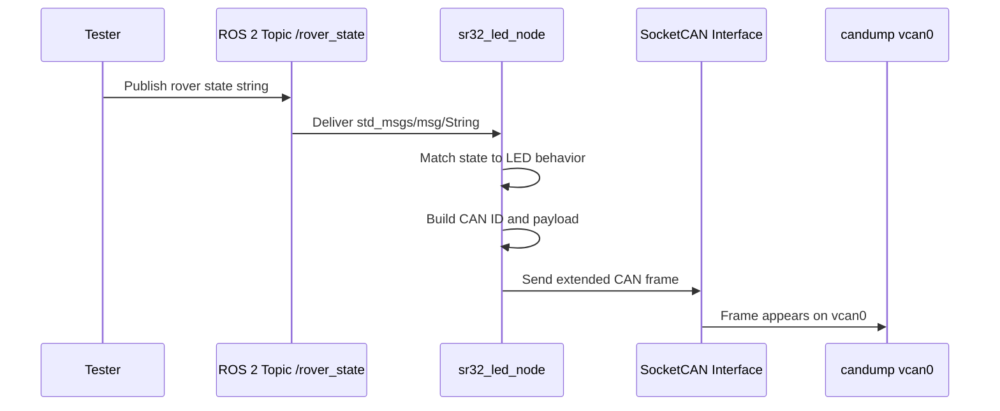
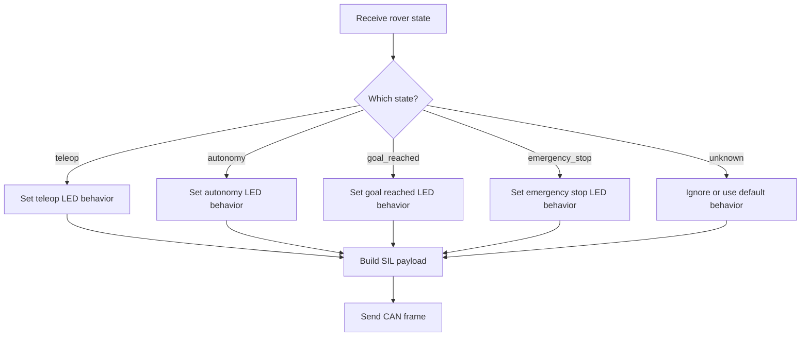
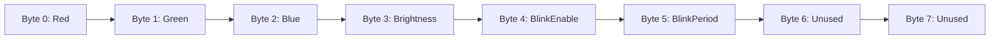
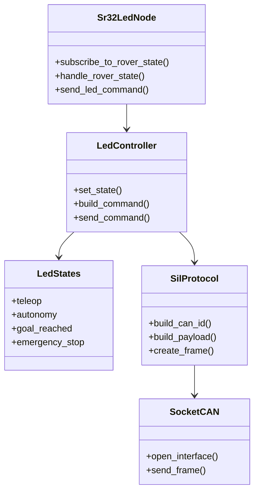
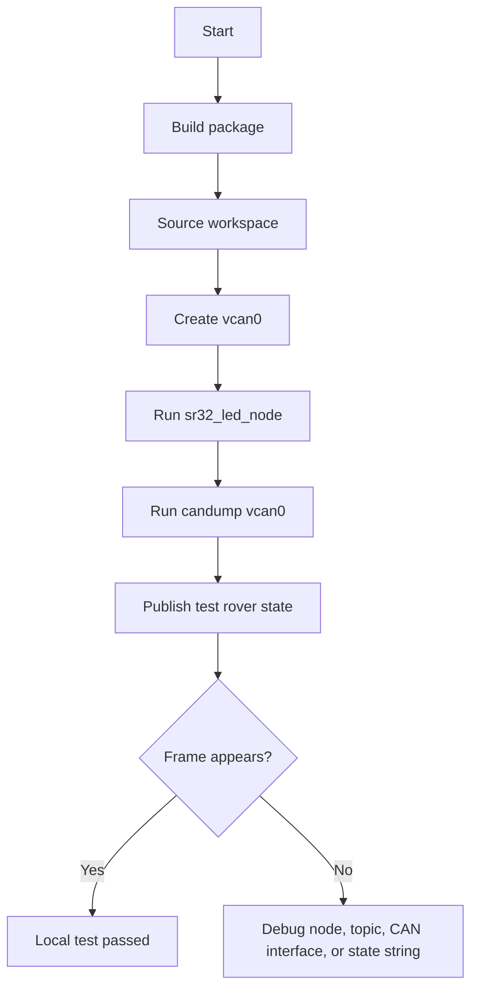
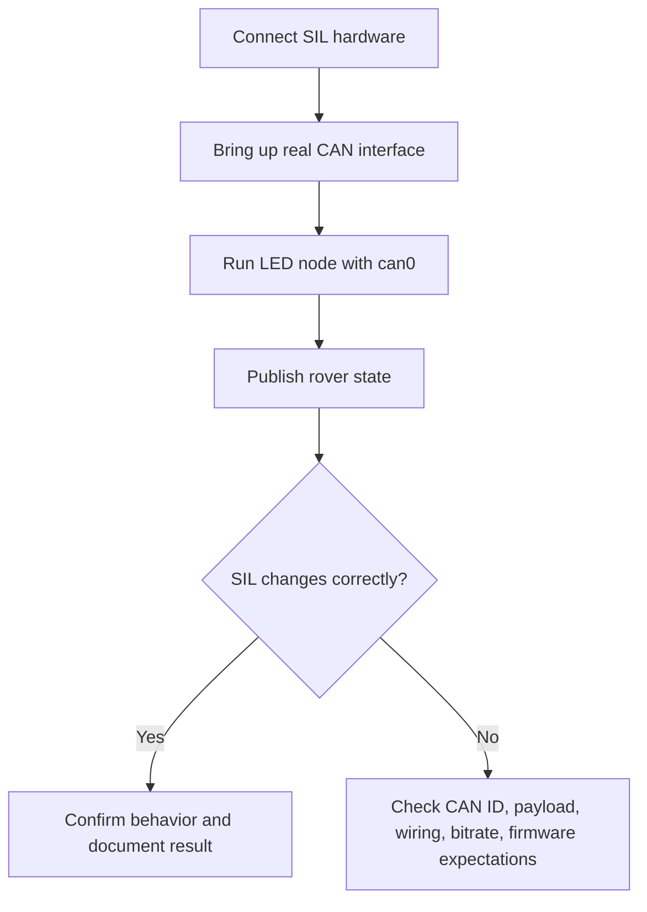

# SR32 SIL LED Controller References and Diagrams

This file gives a visual overview of how the `sr32_led_cpp` package works.

The goal is to help future readers understand the package from a different perspective than the code alone.

---

## 1. Package Overview



This diagram shows the main flow of the package. The rover publishes a state, the LED node receives it, the code decides the correct LED behavior, then a CAN frame is sent to the SIL firmware.

---

## 2. Local Testing Architecture



During local testing, the package does not need physical CAN hardware. Instead, it sends frames to `vcan0`, and `candump vcan0` is used to check whether the frames are being produced correctly.

---

## 3. Runtime Sequence Diagram



This sequence diagram shows what happens when a test state is published from the terminal.

---

## 4. State-to-LED Logic



This diagram explains the decision-making logic. Each rover state is mapped to a LED behavior before the CAN frame is sent.

---

## 5. CAN Payload Layout



Current expected payload format:

```text
[R, G, B, Brightness, BlinkEnable, BlinkPeriod, 0, 0]
```

The SIL firmware currently interprets `BlinkPeriod` as:

```text
BlinkPeriod byte * 10 ms
```

Example:

```text
BlinkPeriod = 50
50 * 10 ms = 500 ms
```

---

## 6. Responsibility Diagram

This is not necessarily an exact C++ class diagram. It is a responsibility diagram that explains how the main parts of the package relate to each other.



This diagram gives a higher-level view of the package responsibilities:

- `sr32_led_node` handles the ROS 2 node behavior.
- `led_controller` handles the LED decision logic.
- `led_states` stores or represents the possible rover states.
- `sil_protocol` handles SIL-specific CAN details.
- SocketCAN sends the frame to `vcan0` or a real CAN interface.

---

## 7. Testing Checklist



This checklist gives a quick visual summary of the local test process.

---

## 8. Future Hardware Testing Checklist



This section should be updated after real SIL testing.

---

## 9. Important Commands

### Set up virtual CAN

```bash
sudo modprobe vcan
sudo ip link add dev vcan0 type vcan 2>/dev/null || true
sudo ip link set up vcan0
```

### Monitor CAN frames

```bash
candump vcan0
```

### Run the LED node

```bash
ros2 run sr32_led_cpp sr32_led_node --ros-args -p can_interface:=vcan0
```

### Publish a test rover state

```bash
ros2 topic pub /rover_state std_msgs/msg/String "{data: 'teleop'}" -1
```


- Confirmed brightness behavior
- Confirmed blink behavior
- Any bugs discovered during hardware testing
